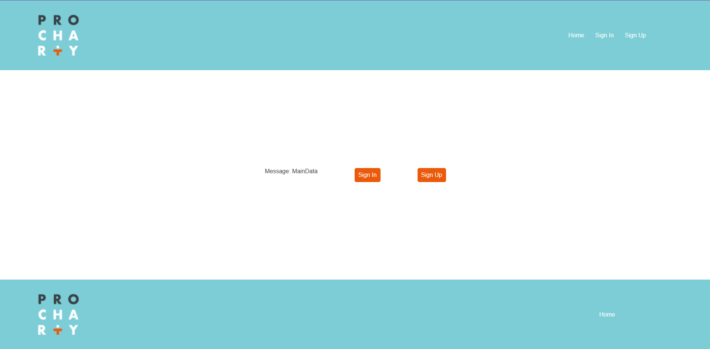
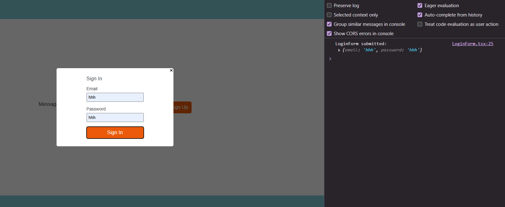

# Тестовое задание на UI-композицию 

## Структура проекта:
- src/ — файлы проекта.
- src/components — папка с TSX-компонентами и их стилями.

### Важные файлы:
- src/App.tsx — точка входа приложения.
- src/containers — папка с контейнерами.
- src/routes — папка с страницами.
- src/screens — папка с формами.
- src/scss — папка с css-переменными и глобальными стилями.

## Что сделала
- Реализовала заданную композицию, оформив стилями
- Настроила типы данных и структуру компонентов
- Добавила фейковое API с моковыми данными для демонстрации
- Настроила клиентский роутинг и формы с обработкой сабмита

## Реализованный функционал
- Отображение UI-компонентов
- Роутинг между страницами
- Формы с валидацией и отправкой
- Работа с моковыми данными

## Технологии
- TS, SCSS, React, Vite
- Работа с fake API, Git

## Инструкция по запуску
Для запуска проекта нужно выполнить несколько шагов:
1. Создайте папку и перейдите в неё: `cd name_folder`
2. Склонируйте данный репозиторий: `git clone https://github.com/MilanaMur/task-react-vite-router.git`
3. Установите зависимости: `npm install`
4. Запустите проект: `npm run dev`